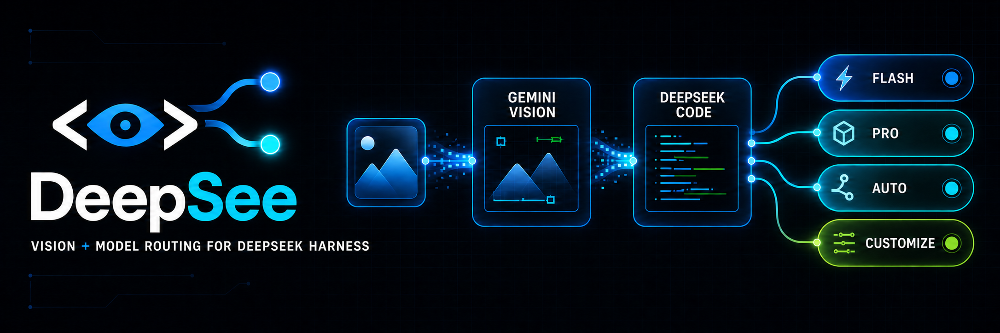
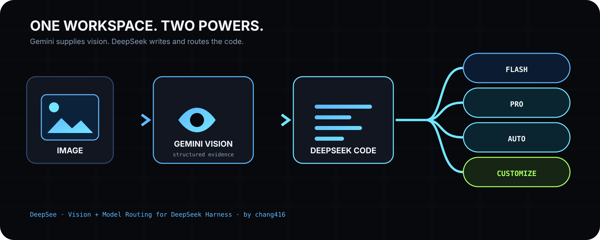
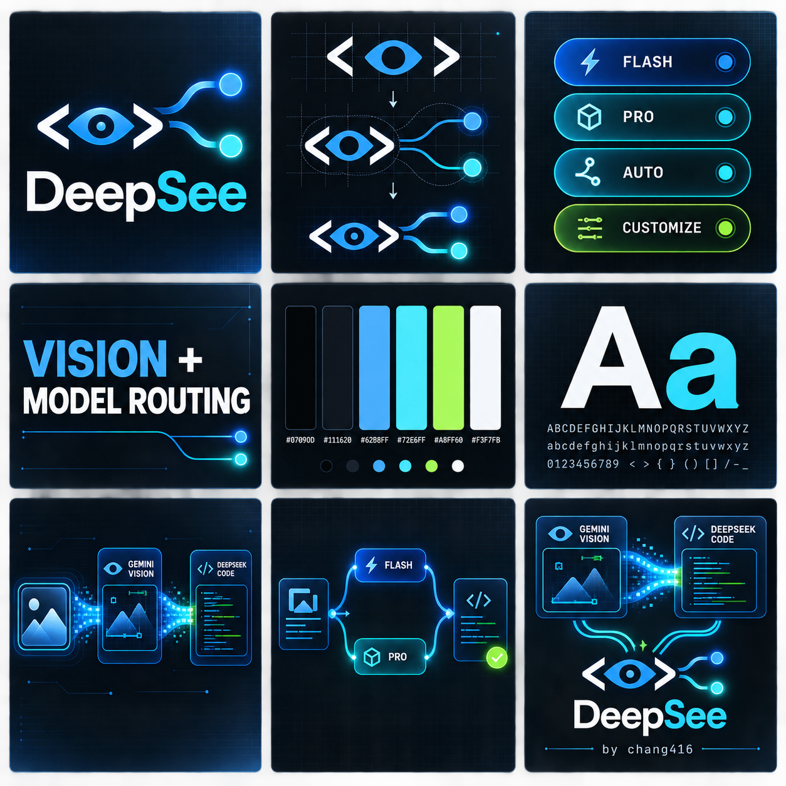

<p align="center">
  
</p>

<h1 align="center">DeepSee</h1>

<p align="center"><b>Vision and smart model routing for DeepSeek Harness.</b></p>

<p align="center">
  <a href="./README.zh-CN.md">简体中文</a> ·
  <a href="docs/troubleshooting.md">Troubleshooting</a> ·
  <a href="skills/deepsee/references/configure.md">Configuration</a> ·
  <a href="docs/output-schema.md">Output contract</a> ·
  <a href="docs/security.md">Security</a>
</p>

<p align="center">
  <a href="https://www.npmjs.com/package/@chang416/deepsee"></a>
  <a href="https://github.com/chang416/deepsee/actions/workflows/ci.yml"></a>
  <a href="https://nodejs.org"></a>
  <a href="LICENSE"></a>
</p>

DeepSee turns DeepSeek Harness into a multimodal, multi-model coding workspace. **Gemini sees. DeepSeek codes.** Choose Flash or Pro directly, or let Auto and Customize split work between them. Paste screenshots into a text-only DeepSeek session, route tasks by cost and difficulty, and visually check the result before delivery.

```sh
npx -y @deepseek-ai/dsh plugin --profile web add @chang416/deepsee@latest
```

Open **DeepSee Settings** to add free Gemini keys (one per line), choose a default preview URL, and customize which work belongs to Flash or Pro.



## Highlights

**DeepSee is both sight and a DeepSeek-native team.** The model selector keeps direct **V4 Flash** and **V4 Pro** choices and adds two orchestration modes:

- **DeepSee Auto** ships with a free-first routing policy. Flash takes discovery, documentation, tests, small edits, and bounded bug fixes; Pro takes architecture, security, risky refactors, integration, and final review. Independent subtasks run in parallel and the coordinator merges the result.
- **DeepSee Customize** lets each user choose Flash or Pro for every work category. Selecting it for the first time opens **DeepSee Settings** inside the Harness interface, where the routing map can be changed without editing JSON.
- **It looks before it delivers.** For UI work, DeepSeek can start the local preview and call Gemini at meaningful milestones and again before delivery. Gemini returns a strict `PASS` or a screen location plus the defect to fix; DeepSeek iterates within a configurable free-quota limit instead of asking the user to discover visual mistakes afterward.
- **DeepSeek writes the code.** Gemini is used only as the visual reader. The coding lanes stay on DeepSeek V4 through whichever live route the user already has: the official provider, OpenCode's `deepseek-v4-flash-free`, or OpenCode Go's `deepseek-v4-flash` and `deepseek-v4-pro`.
- **Multiple free Gemini keys.** Paste one key per line. DeepSee deduplicates them and automatically advances to the next key on authentication, quota, or rate-limit exhaustion; saved keys are write-only in the interface and never returned to the browser.

One install adds the native `read_image` bridge, DeepSee Auto and Customize, multi-key Gemini rotation, OpenCode/OpenCode Go-aware DeepSeek routing, and the `deepsee_visual_check` delivery gate. If dsh warns `declares no dsh.bundle`, see [troubleshooting](docs/troubleshooting.md#dsh-says-declares-no-dshbundle--installed-as-a-plain-dependency).

Pasting an image works two ways. **① Just paste.** On a text-only model the pasted image lands as a private temp file and its path enters the composer — the same interaction OpenCode and Pi ship — and the `read_image` tool takes it from there. **② Pick a `(deepsee vision)` entry** in the model selector (it remembers your choice, so once is enough), then paste: the thumbnail stays visible in your message, closer to the Codex app feel, and the image is converted to structured evidence at request time, answered by the same underlying route. The plugin auto-discovers every provider route carrying text-only DeepSeek or GLM models and adds a wrapped entry per route (a stock install gets **`DeepSeek-V4-Flash (deepsee vision)`** and **`DeepSeek-V4-Pro (deepsee vision)`**; extra routes like opencode-go or zai get their own); the two families' own vision models are excluded automatically. Which paste route applies is the host's per-model call: only a model its metadata positively confirms text-only is taken over, anything unconfirmed is left alone, so vision models keep their native paste ([details](docs/harness-setup.md)).

**Paste an image and DeepSeek can use it.** No model swap and no manual transcription.

- **Native and removable.** DeepSee is one dsh plugin or one skill folder, with no local proxy daemon. Remove it and the host returns to its original behavior.
- **Zero-config start.** Reuses what Claude Code, Codex, OpenCode, or Pi already have set up: the multimodal models on your machine go straight to work. Nothing at all? Antigravity CLI is a free no-key channel, and a free Gemini key brings a read down to 5-10 seconds.
- **Evidence, not imagination.** Full transcription, reading-order layout regions, entity and relation lists. The model quotes specifics.
- **Install once, use everywhere.** Verified on real machines in Claude Code, Codex, Pi, and OpenCode.

## Installation

**Step 1, hand it to your AI.** Send it this line:

> Install and configure the deepsee skill following https://github.com/chang416/deepsee/blob/main/INSTALL.md, then run the health check and tell me the result.

The install starts by checking what your machine already has. An existing login in Claude Code, Codex, OpenCode, or Pi can be enough: deepsee asks before reusing any of them, and the health check tells you where things stand.

**Step 2, only if the health check comes back empty, set up a free engine.** The recommended choice is a free Gemini API key (about three minutes at [Google AI Studio](https://aistudio.google.com), no credit card), which also makes every read 5-10 seconds. A free OpenAI-compatible key from another platform works too. To avoid any sign-up, install Antigravity CLI instead, then sign in:

```bash
curl -fsSL https://antigravity.google/cli/install.sh | bash
agy                                                           # sign in, then exit
```

The install also inventories vision reachable through your other local harness CLIs (Codex, OpenCode, Pi) and asks, per harness, whether deepsee may reuse it. Granted logins join the engine pool as equals, and every reused read is labeled with whose quota it spent.

## Usage

Once installed, just chat. Paste an image or drop a path, ask anything, and the skill triggers on its own: the image goes to a vision engine and the answer comes back grounded in what it read.

## Vision engines: five built-in providers, four reusable CLIs, one failover chain

DeepSee does not depend on any single vision service. Nine sources of vision in total: five built-in providers, any one of which is enough, plus four local agent CLIs whose logins can be reused. The built-ins:

| Provider | What it needs | Speed per read | Good for |
| :-- | :-- | :-- | :-- |
| `gemini-api` | a free Gemini API key ([3 minutes, no card](https://aistudio.google.com)) | 5-10s | the recommended default |
| `openai` | any OpenAI-compatible endpoint (key + baseUrl + model) | 5-10s | qwen-vl, GLM, self-hosted gateways |
| `anthropic` | an Anthropic API key | 5-10s | machines already holding one |
| `antigravity-cli` | the free `agy` CLI, one browser sign-in, no key | 15-45s | zero-signup starts |
| `claude-cli` | a signed-in Claude Code | 20-45s | riding your existing Claude subscription |

Without a pinned provider, every configured engine forms one failover chain: the fast API providers try first, the agent CLIs back them up, the first good result wins, and `meta.attempts` records every attempt so a fallback is never silent.

### `openai` is a universal socket, not just OpenAI

Any endpoint speaking the OpenAI chat-completions protocol with image input plugs straight in — that covers most of the vision-model world:

```bash
deepsee config set openai.baseUrl https://dashscope.aliyuncs.com/compatible-mode/v1   # qwen-vl
deepsee config set openai.apiKey  <key>
deepsee config set openai.model   qwen3-vl-plus
```

The same three keys work for GLM's open platform, SiliconFlow, OpenRouter, a self-hosted vLLM/Ollama, or any gateway of your own. If your favorite vision model has an OpenAI-compatible API, DeepSee can drive it.

### Reusing what your machine already has

Two more sources of vision need zero new keys, each behind one explicit consent recorded in config:

- **The harness you are talking in right now.** Running inside Claude Code with a subscription signed in? `claude-cli` reads images through it out of the box. The install flow asks the same question for whichever harness you install into.
- **Every other agent CLI on the machine.** `deepsee doctor` discovers them, you grant per harness, and they join the same failover chain with no priority over your own keys. Every reused read is labeled in `meta.warnings` with whose quota it spent, so nothing is ever silently billed:

| Reused CLI | What it needs | Grant with | Rides as |
| :-- | :-- | :-- | :-- |
| Codex | a signed-in Codex CLI with a vision model | `config set reuse.codex true` | agent lane, 15-45s |
| OpenCode | a vision model configured in OpenCode | `config set reuse.opencode true` | agent lane, 15-45s |
| Pi | model credentials held by Pi | `config set reuse.pi true` | an API key upgrades to the 5-10s inline lane, OAuth drives Pi itself |
| Grok | a signed-in Grok CLI (SuperGrok) | `config set reuse.grok true` | agent lane, 15-45s |

### Picking and routing

Two knobs: `deepsee config set provider <name>` states a preference (the chain still backs it up), `-p <name>` pins exactly one with no fallback. Machines behind a proxy set `HTTPS_PROXY` or `deepsee config set proxy <url>` and the API providers route through it. Details: the [CLI manual](docs/cli.md) for defaults and flags, [Configuration](skills/deepsee/references/configure.md) for every key, and [Security](docs/security.md) for who fetches what on remote URLs.

## The product in one frame



The launch demo follows one complete task: paste a UI reference, let Auto route implementation and review across Flash and Pro, watch Gemini inspect the rendered result, then deliver only after the final visual check passes. Every frame shown in the demo comes from a real DeepSee run.

## Documentation

| Doc | Read it when |
| :-- | :-- |
| [Install guide](INSTALL.md) | Installing the skill step by step (written for an agent) |
| [CLI manual](docs/cli.md) | The CLI the skill drives: flags, config, doctor |
| [Troubleshooting](docs/troubleshooting.md) | A command failed and the message needs decoding |
| [Configuration](skills/deepsee/references/configure.md) | Setting a key, switching providers, fixing config |
| [Output contract](docs/output-schema.md) | Parsing the JSON or building on it |
| [Harness setup](docs/harness-setup.md) | Wiring it into Codex, Claude Code, Pi, or OpenCode |
| [Security](docs/security.md) | File permissions, image content as untrusted input |
| [CHANGELOG](CHANGELOG.md) | Finding what changed in a version |

## Contributing

Focused pull requests are welcome. Keep each PR scoped, explain the user-visible behavior, add or update tests, and run `pnpm lint`, `pnpm typecheck`, `pnpm test`, and `pnpm build` before opening it.

- **[Open an issue](https://github.com/chang416/deepsee/issues).** Bugs, suggestions, confusing errors, and unclear docs all help.
- **Read [CONTRIBUTING.md](CONTRIBUTING.md).** Security reports follow [SECURITY.md](SECURITY.md), not public issues.

## Disclaimer

Provided as-is under the MIT License below. The author makes no warranty and gives no endorsement for any particular use, commercial use included. Your use of upstream engines (Antigravity CLI, the Gemini, OpenAI, and Anthropic APIs, and any OpenAI-compatible endpoint) is governed by their own terms and quotas, which you are responsible for.

## Acknowledgements

DeepSee is designed, developed, and maintained by **chang416**. Early exploration referenced a small amount of the MIT-licensed [ModLens](https://github.com/liustack/modlens) project; its required copyright notice remains in [LICENSE](LICENSE). DeepSee's product architecture, Auto/Customize orchestration, settings experience, Gemini key rotation, OpenCode-aware routing, and visual self-check loop are developed for DeepSee.

## License

MIT
